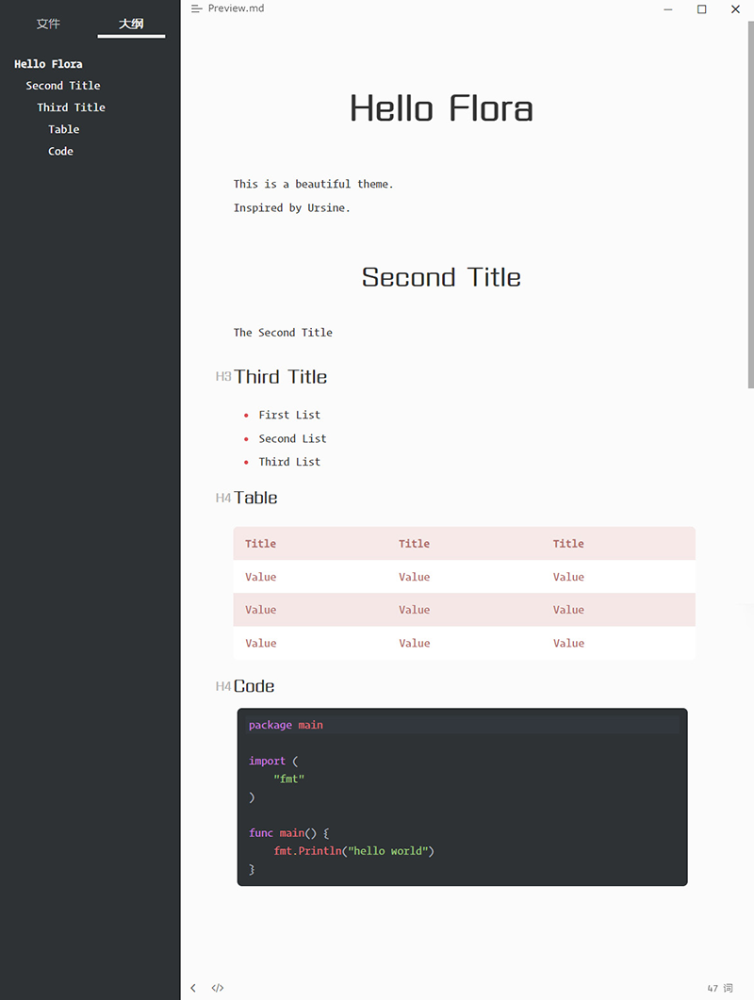
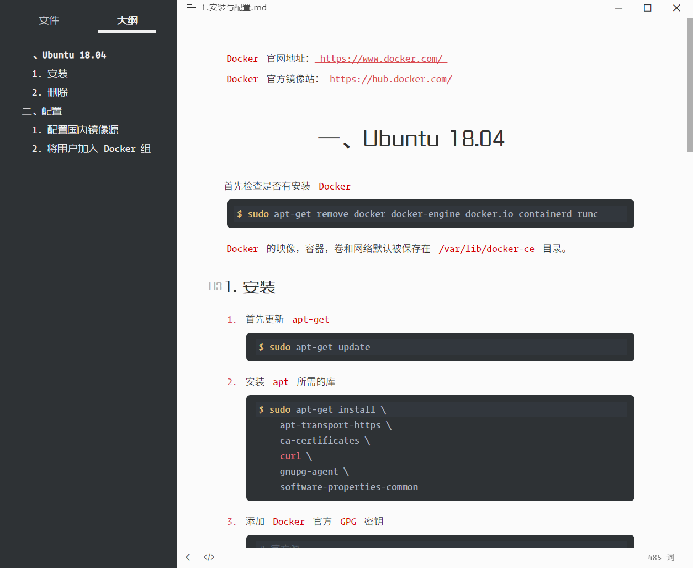
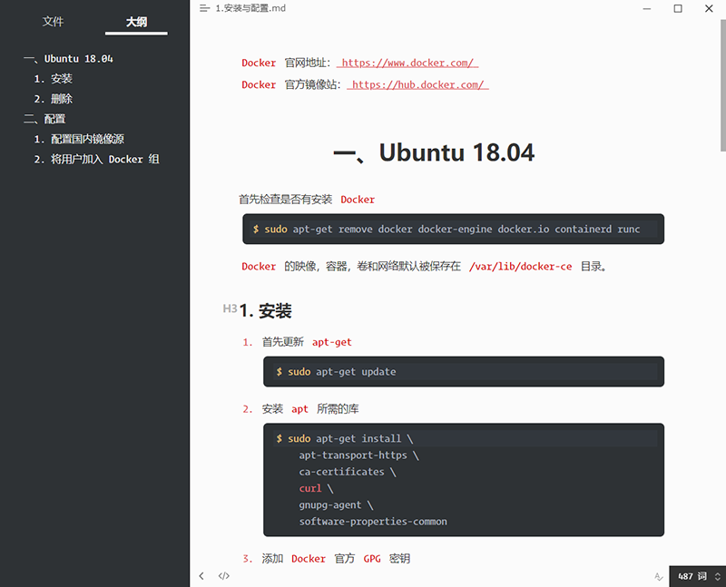

# typora-theme-flora
A theme that looks as beautiful as flora.

This is a theme based on `Ursine`: [https://github.com/aCluelessDanny/typora-theme-ursine](https://github.com/aCluelessDanny/typora-theme-ursine)

## Preview

### English Preview

### Chinese Preview

Because of some people don`t like the font of headers. So I provide a version which use Source Han Sans as the font of headers.

由于有部分朋友不太喜欢我在标题上使用的字体，所以也提供了标题使用思源黑体的版本。

## Installation

You can download latest version of this theme on [release page](https://github.com/wnanbei/typora-theme-flora/releases/). Then copy all decompressed files to typora theme folder.

安装主题请先到 [发布](https://github.com/wnanbei/typora-theme-flora/releases/) 页面下载最新版的文件，解压缩后将所有内容复制到 Typora 的 `themes` 目录中。

